<div align="center">

  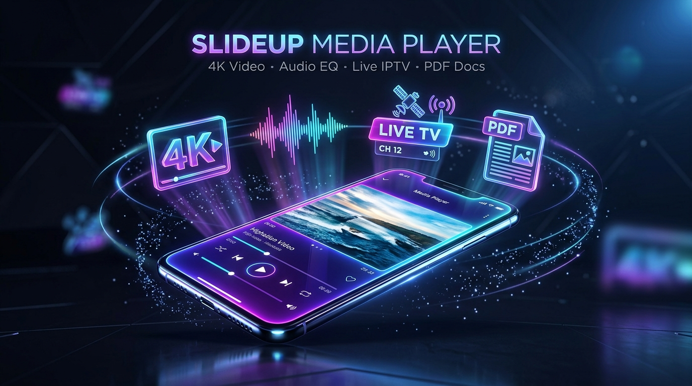

  # 🎬 SlideUp Media Player
  ### *Professional All-in-One Media & Document Suite for Android*

  [](https://github.com/hinditutorpoint/slideup/actions/workflows/build_release.yml)
  [](https://flutter.dev)
  [-3DDC84?logo=android)](https://developer.android.com)
  [](LICENSE)
  [](https://hinditutorpoint.github.io/slideup/)
  [](https://hinditutorpoint.github.io/slideup/intro_video.html)

  <p align="center">
    <a href="https://hinditutorpoint.github.io/slideup/"><b>Explore Website Portal</b></a> •
    <a href="https://hinditutorpoint.github.io/slideup/intro_video.html"><b>Watch 60FPS Promo Video</b></a> •
    <a href="#-download-release-apks"><b>Download Latest APKs</b></a> •
    <a href="#-key-features"><b>Features</b></a> •
    <a href="#-contributing"><b>Contributing</b></a>
  </p>

</div>

---

## 📱 Visual Showcase & Screenshots

<div align="center">

### 🎬 4K Video Player & Floating Picture-in-Picture (PiP)
| 4K Ultra Player | Floating PiP Window | Home & Recent Media |
| :---: | :---: | :---: |
| 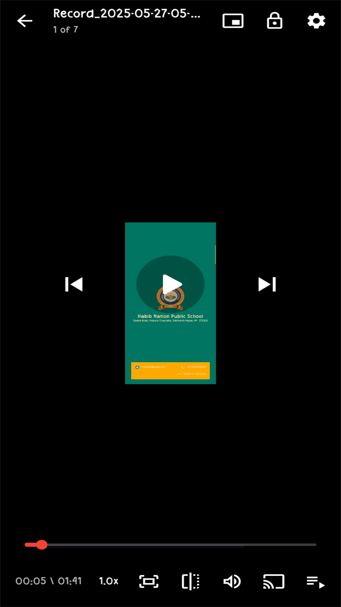 | 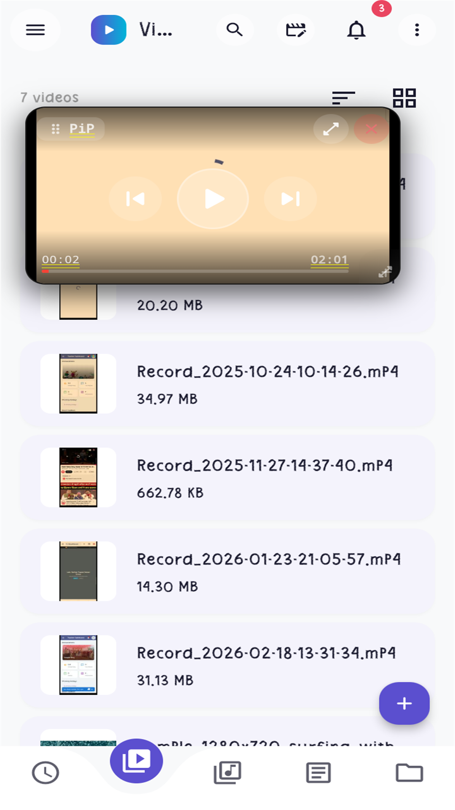 | 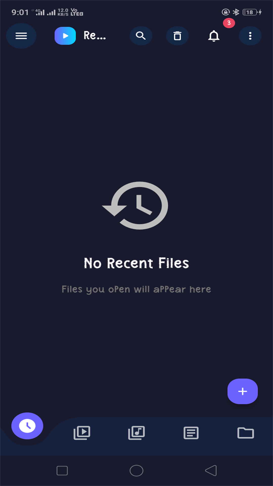 |

### ✂️ Precision Video Editor & Timeline Tools
| Timeline Trimming | Filters & Speed Ramping | Image Overlays |
| :---: | :---: | :---: |
| 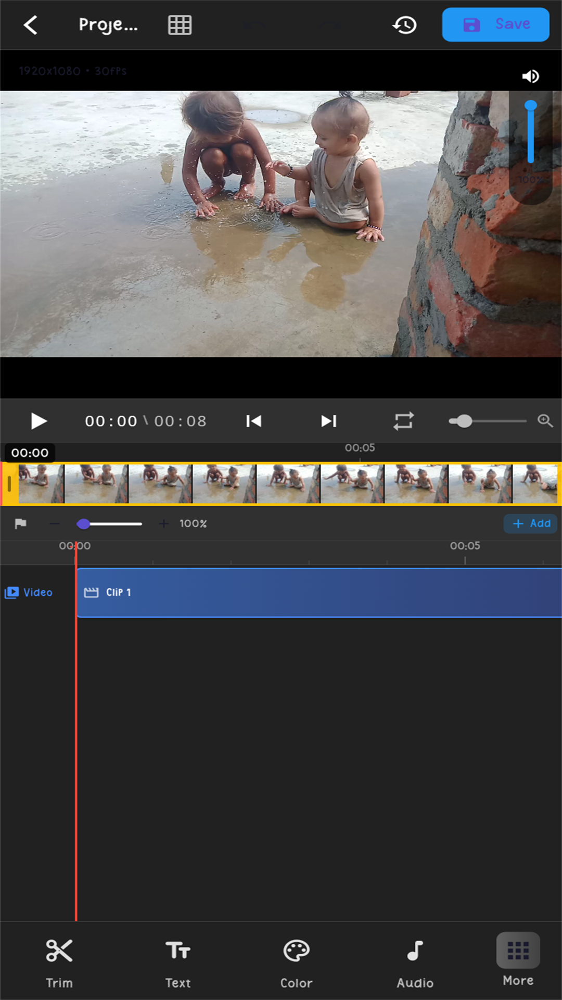 | 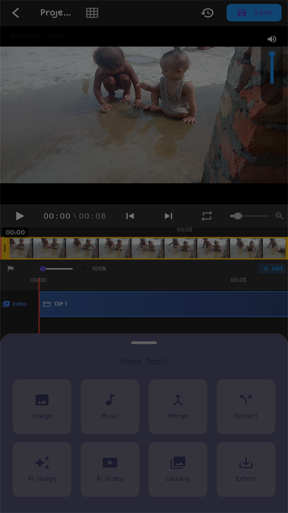 | 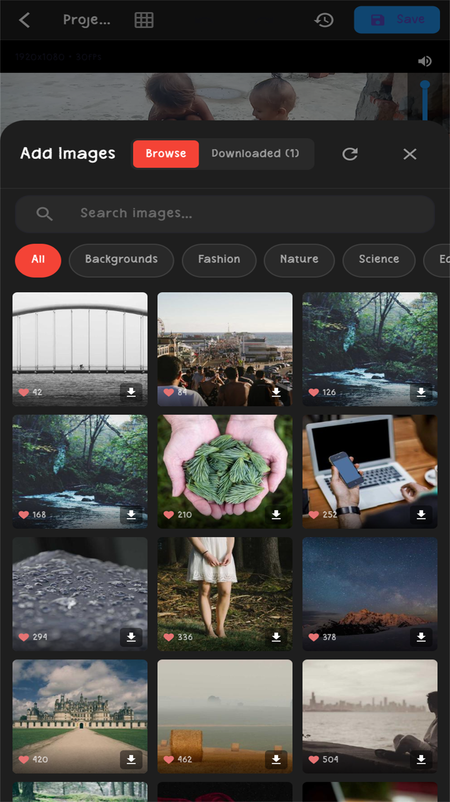 |

### 🎵 High-Fidelity Audio Player & 📺 1000+ Live IPTV Channels
| Lossless Music & Equalizer | Live IPTV Player | IPTV Playlists & Categories |
| :---: | :---: | :---: |
| 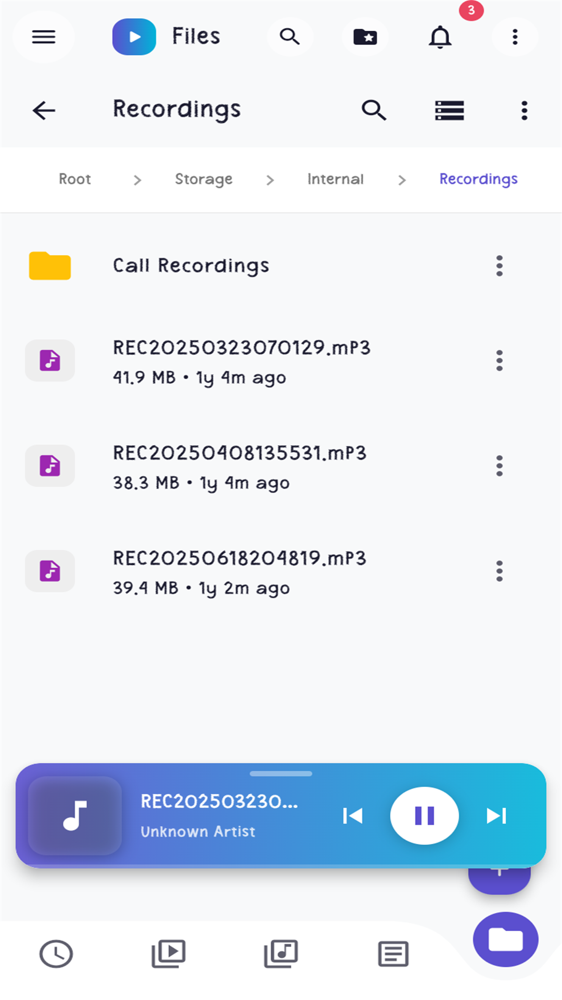 | 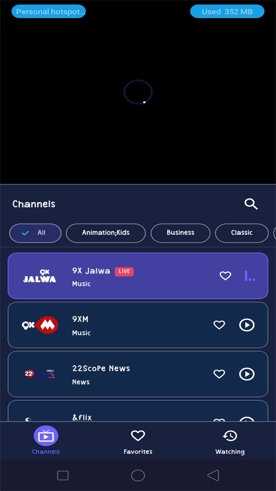 | 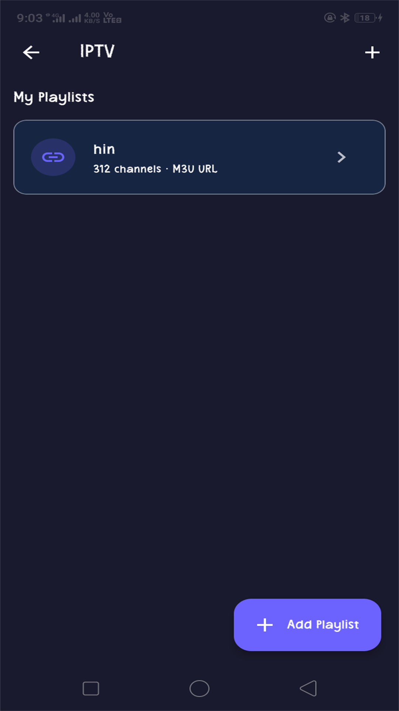 |

### 📚 Document Reader, 🔄 Media Converter & 🌐 Private Browser
| PDF & EPUB Reader | Batch Media Converter | Private Web Browser |
| :---: | :---: | :---: |
| 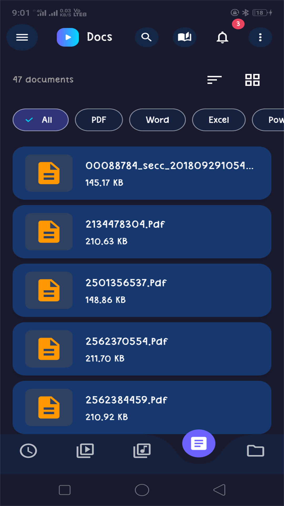 | 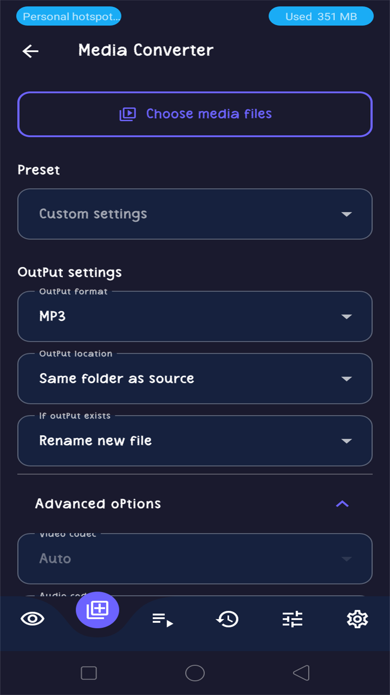 | 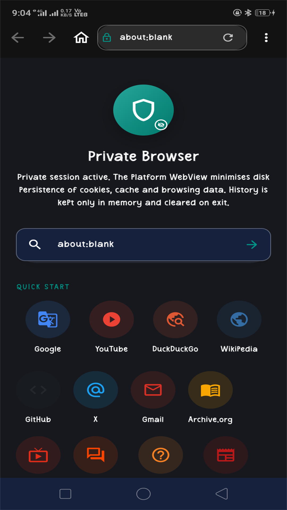 |

</div>

---

## 🚀 Download Release APKs

Directly compiled and optimized by GitHub Actions Release Pipeline:

| Architecture | Device Compatibility | Download Link |
| :--- | :--- | :---: |
| **ARM64 (v8a)** *(Recommended)* | Modern 64-bit Android smartphones & tablets | [**Download ARM64 APK**](https://github.com/hinditutorpoint/slideup/releases/latest/download/app-arm64-v8a-release.apk) |
| **ARMv7 (32-bit)** | Older 32-bit smartphones and legacy devices | [**Download ARMv7 APK**](https://github.com/hinditutorpoint/slideup/releases/latest/download/app-armeabi-v7a-release.apk) |
| **x86_64** | Android emulators & Windows Subsystem for Android | [**Download x86_64 APK**](https://github.com/hinditutorpoint/slideup/releases/latest/download/app-x86_64-release.apk) |

> 📦 View all releases and changelogs on the [**GitHub Releases Page**](https://github.com/hinditutorpoint/slideup/releases).

---

## ✨ Key Features

### 🎬 1. Advanced 4K Video Player
- **Ultra-Fast Rendering Engine:** Powered by `media_kit` (libmpv backend) for seamless playback of MP4, MKV, AVI, FLV, WEBM, TS, MOV, etc.
- **Smart Dual Gestures:** Swipe left side for Brightness, right side for Volume, horizontal swipe for precision scrubbing.
- **Picture-in-Picture (PiP):** Floating background mini-window (`simple_pip_mode`) while using other apps.
- **Audio & Subtitle Controls:** Multi-audio track switching, external subtitle loader, 0.25x – 4.0x speed regulation, and hardware equalizer.
- **Extraction Tools:** Capture lossless frames (PNG, JPG, BMP) or extract audio tracks into MP3/FLAC.

### ✂️ 2. Professional Video & Reel Editor Suite *(Beta / Under Active Testing)*

> ⚠️ **Status Note:** The Video & Reel Editor suite is currently under **active development, testing, and stabilization**. Core editing, timeline, overlay, audio, and AI features are implemented and functional, but performance optimizations, edge-case hardening, and export pipeline integrations are actively progressing.

#### 📊 Video Editor & Reel Editor — Implementation & Testing Matrix

| Module / Feature Area | Description & Capabilities | Development & Testing Status |
| :--- | :--- | :---: |
| **Hybrid Magnetic Timeline** | Multi-track timeline supporting primary video clips, slice trimming, reordering, duplicate, delete & millisecond-accurate seek preview. | 🧪 **Beta (Under Testing)** |
| **Interactive Canvas Overlay** | Direct on-screen drag, pinch-to-resize, rotation, boundary alignment snapping, and z-index ordering for all visual layers. | 🧪 **Beta (Under Testing)** |
| **Multi-Track Audio Mixer** | Real-time Premiere Pro-style audio mixer playing primary video audio + layered background MP3s simultaneously with drift compensation. | 🧪 **Beta (Under Testing)** |
| **Pixabay Stock Asset Engine** | In-app search & preview streaming for 100K+ royalty-free stock music & 4K stock videos with single-tap timeline insertion. | 🧪 **Beta (Under Testing)** |
| **AI Image Generator (`AiTab`)** | Compact generative AI studio supporting text prompts, negative prompts, artistic styles, aspect ratios & 1-tap timeline placement. | 🧪 **Beta (Under Testing)** |
| **Frame Filmstrip Generator** | High-performance asynchronous frame thumbnail caching across timeline clips with responsive multi-zoom support. | 🟡 **Functional (Optimizing)** |
| **Keyframing & Speed Ramping** | Linear & bezier speed ramping (0.1x – 8.0x) with keyframe interpolation and audio pitch preservation. | 🧪 **Beta (Under Testing)** |
| **Persistent File Picker** | System-wide secure storage remembering last opened directory when choosing audio, video, or export destinations. | 🟡 **Functional (Testing)** |
| **Typography & Text Styling** | Multi-font editor with rich typography, outlines, shadows, background badges, and entry/exit animation presets. | 🟡 **Functional (Testing)** |
| **Color Grading & Filters** | Brightness, Contrast, Saturation, Temperature, Tint, Vignette, Hue + curated cinematic LUT filter presets. | 🟡 **Functional (Testing)** |
| **Reel 9:16 Canvas & Safe Areas** | Dedicated Instagram Reel / YouTube Shorts / TikTok aspect ratios with overlay safe-zone guides. | 🟡 **Functional (Testing)** |
| **Transitions Engine** | FFmpeg `xfade` transitions (dissolve, wipe, slide, circle, zoom) between video cuts. | 🚧 **In Development / Testing** |
| **Background Export Pipeline** | Multi-preset rendering (720p, 1080p, 4K) with automatic temporary file cleanup on cancel/failure. | 🚧 **In Development / Testing** |

- **Multi-Track Timeline Architecture:**
  - Layered non-linear timeline supporting concurrent Video, Audio, Voiceover, Text, Image overlays, Stickers, and Shapes.
  - High-performance asynchronous thumbnail generation with smooth caching and timeline zooming (0.5x – 3.0x).
  - Precision frame-by-frame navigation, split/slice at playhead, duplicate, delete, and drag-and-drop layer reordering.
- **Interactive Multi-Touch Canvas:**
  - Direct manipulation on canvas: drag-to-position, pinch-to-scale, rotate, boundary snap guides, and z-index ordering.
  - Standard social media aspect ratio presets: **9:16** (Reels/Shorts/TikTok), **1:1** (Square), **4:5** (Portrait/Feed), **16:9** (Landscape/YouTube), **4:3**, **3:4**, and **Custom**.
- **Precision Trimming, Speed Ramping & Motion:**
  - Millisecond-accurate trim controls with visual wave and frame previews.
  - Variable speed ramping (0.25x – 4.0x) with audio pitch preservation.
  - Video transform tools: horizontal/vertical flip, 90° incremental rotation, and custom cropping.
- **Rich Typography & Text Styling:**
  - Multi-font support with customizable typography, alignment, letter spacing, and line height.
  - Advanced styling: solid & gradient colors, custom borders/strokes, drop shadows, background badges, and entry/exit animations.
- **Color Grading, Filters & Video Effects:**
  - Professional color adjustment suite: Brightness, Contrast, Saturation, Temperature, Tint, Exposure, Vignette, and Hue.
  - Curated cinematic filters, LUTs, visual special effects, and seamless transition animations between cuts.
- **Audio Mixing & Sound Studio:**
  - Multi-channel audio mixer with real-time audio sync and drift correction.
  - Dedicated volume controls per track, master volume control, audio ducking, and customizable fade-in/fade-out envelopes.
  - Integrated royalty-free music search (via Pixabay API) and local device audio picker.
- **AI Creation & Asset Integrations:**
  - Built-in AI Image Generation from text prompts with style presets, negative prompts, and aspect ratio matching.
  - In-app media browser with album filtering for fast multi-clip and image importing.
- **Background Rendering & Export Engine:**
  - High-throughput rendering pipeline powered by FFmpeg and hardware-accelerated MediaCodec encoding.
  - Flexible export presets: 720p, 1080p Full HD, 2K, 4K Ultra HD at 24/30/60 FPS with custom bitrate controls.
  - Android Foreground Service execution ensuring background exports never get killed by OS battery optimizations.
  - Robust project state management: full Undo/Redo history, auto-saving, draft management, and crash-resilient project recovery.

### 🔄 3. Batch Audio & Video Converter
- **Multi-Format Transcoding:** Audio→Audio, Video→Video, and Video→Audio (MP3, AAC, FLAC, WAV, Opus, MP4, MKV, WebM, etc.).
- **Hardware Acceleration:** Auto-detect MediaCodec accelerated encoding.
- **Background Foreground Service:** Converts large media queues reliably in the background with persistent progress notifications.

### 📺 4. Live IPTV & Radio Streaming
- **Multiple Playlist Sources:** Import via M3U URLs, local `.m3u` files, or XTream Codes API.
- **Split Screen Player:** Watch live in the top viewport while exploring categories and channels below.
- **28+ Language Quick-Start:** One-tap presets for Hindi, English, Tamil, Telugu, Bengali, Malayalam, and more.

### 🎵 5. Audio Player & Speaker Suite
- **Lock Screen & Notification Controls:** Full playback controls via `audio_service` and `just_audio`.
- **Sound Equalizer:** 10-band equalizer presets (Rock, Pop, Jazz, Bass Boost) + Speaker Volume Booster.

### 📚 6. Document & E-Book Reader
- **PDF Viewer:** Continuous scroll, text search, page jumping, and bookmarks (`syncfusion_flutter_pdfviewer`).
- **EPUB Reader:** E-book reader with chapter index, font scaling, night mode, and reading progress tracking.
- **TXT Reader:** Distraction-free clean text viewer.

### 🔒 7. Biometric Vault & File Manager
- **Local Authentication:** Lock confidential files using Fingerprint, Face Unlock, or PIN code (`local_auth`).
- **Encrypted Storage:** Sandboxed vault isolated from public gallery scanners.

### 🌐 8. Private Browser
- **Incognito Browsing:** Built-in tracker and ad suppression with direct media downloading.

---

## 🛠️ Technology Stack

| Component | Library / Framework |
| :--- | :--- |
| **Framework** | Flutter 3.29+ / Dart 3.8+ |
| **State Management** | Riverpod (`flutter_riverpod`) |
| **Video Engine** | MediaKit (`media_kit`, `media_kit_video`, `libmpv`) |
| **Video Processing** | FFmpeg Kit (`ffmpeg_kit_flutter_new`) |
| **Audio Engine** | JustAudio & AudioService (`just_audio`, `audio_service`) |
| **PDF & Documents** | Syncfusion PDF Viewer (`syncfusion_flutter_pdfviewer`) |
| **Storage & Database** | SQLite (`sqflite`), Hive (`hive_flutter`), SecureStorage |
| **Security & Auth** | LocalAuth (`local_auth`), Crypto (`crypto`) |

---

## 🤝 Contributing

Contributions are welcome and appreciated! Whether you want to fix bugs, add new features, or improve the documentation, we'd love your help.

1. **Fork the Repository** & create your branch from `main`:
   ```bash
   git checkout -b feat/your-feature-name
   ```
2. **Setup your environment** following our [Setup Guide](SETUP_GUIDE.md).
3. **Commit your changes** with clear messages.
4. **Ensure code cleanliness**: Run `flutter analyze` and `flutter test` before submitting.
5. **Open a Pull Request** describing your changes.

For detailed guidelines, code formatting standards, and architecture details, please read our [Contributing Guide](CONTRIBUTING.md).

---

## 📜 License & Intellectual Property

Copyright (c) 2026 SlideUp Project (hinditutorpoint). All rights reserved.

This project is licensed under a **Restricted Source-Available License**. You are permitted to inspect, evaluate, and learn from the source code for personal and educational purposes, but you may **NOT** clone, re-brand, distribute, or publish this software on any app store without express written authorization. See the [LICENSE](LICENSE) file for complete terms.
